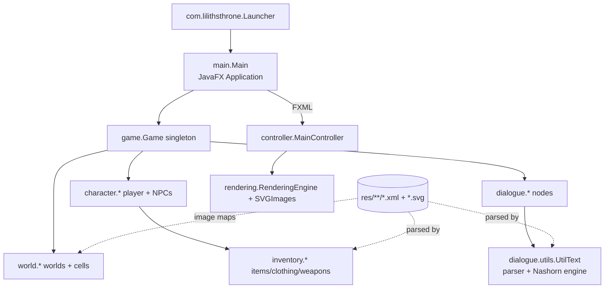

# Lilith's Throne — Architecture Overview

Audience: developers and AI agents modernizing this codebase. This is a pragmatic map of
how the game is put together, where the important seams are, and where the performance and
correctness risks live. Pair this with `.github/copilot-instructions.md`.

> Status: living document. Update it when you learn something durable.

## 1. High-level shape
Single-module JavaFX desktop application.

- **Language/runtime:** Java (source level 25), built and run on JDK 25 (LTS). JavaFX for UI,
  Nashorn (external `org.openjdk.nashorn`) for the in-content scripting language.
- **Scale:** ~980 `.java` files under `src/`, ~5,500 asset files under `res/`.
- **Content-as-data:** most game text, items, clothing, dialogue, encounters and world maps
  are authored as `res/**/*.xml` (+ `.svg` art), interpreted at runtime. A lot of "logic"
  actually lives in these XML files via an embedded scripting syntax (see §5).
- **State:** a single mutable `Main.game` (`com.lilithsthrone.game.Game`) singleton holds the
  whole world; saves are XML serializations of that state.

## 2. Entry & startup sequence
1. `com.lilithsthrone.Launcher.main` → `com.lilithsthrone.main.Main.main`
   (the wrapper exists because JavaFX is a separate module, not on the boot classpath).
2. `Main.main`: create `data/` dirs, redirect stderr to `data/error.log` (non-debug),
   load/create `data/properties.xml`, then JavaFX `launch()`.
3. `Main.start`: verify `res/` present, build credits, set window icon, load fonts, load
   `/com/lilithsthrone/res/fxml/main.fxml`, apply theme CSS, create `MainController`.
4. `Main.startNewGame`: `new Game()` → `new Generation()` (a JavaFX `Task<Boolean>`) run on a
   background thread → on success create `PlayerCharacter`, `game.initNewGame(...)`,
   `game.endTurn(0)`.

Heavy work at startup:
- **World generation** — `world/Generation.java` (`extends javafx.concurrent.Task`) loads a
  `BufferedImage` per `WorldType` and maps pixel colours → `PlaceType`, building `Cell[][]`
  grids. Runs as a `parallelStream` over world types.
- **Static content initializers** — `ItemType`, `ClothingType`, `Subspecies`, weapons, spells
  (~600 types) initialize eagerly on first class load.
- **Nashorn init** — `UtilText.initScriptEngine()` builds the JS engine used to evaluate
  content scripts (also invoked before loading a save).

## 3. Package map (the parts that matter)
| Package | Responsibility |
|---|---|
| `com.lilithsthrone.main` | `Main` (JavaFX app, `main()`, global statics like `game`, `sex`, `combat`, XML factories). |
| `com.lilithsthrone.controller` | JavaFX controllers (`MainController`), `FileController` (WebView/DOM glue), tooltip threads. |
| `com.lilithsthrone.rendering` | `RenderingEngine`, `SVGImages` (SVG string cache + colourized variants). |
| `com.lilithsthrone.game` | `Game` singleton (world state, turn loop, **save/load** `exportGame`/`importGame`), `Properties`. |
| `com.lilithsthrone.game.dialogue` | Dialogue nodes/responses; `dialogue.utils.UtilText` = content parser + Nashorn engine. |
| `com.lilithsthrone.game.character` | `GameCharacter`, `PlayerCharacter`, `NPC`, body/attributes/race/persona. |
| `com.lilithsthrone.game.inventory` | Items, clothing, weapons + their `*Type` registries. |
| `com.lilithsthrone.game.sex` / `.combat` | Sex and combat engines (`Sex`, `Combat`, managers, actions). |
| `com.lilithsthrone.world` | `WorldType`, `Generation`, `Cell`, `PlaceType`, map model. |
| `com.lilithsthrone.utils` | `Util` (incl. seedable `Util.random`), colours, helpers. |

## 4. Save / load
- Format: **XML**, DOM-based (`javax.xml.parsers` `DocumentBuilder`, factories held on `Main`).
- Code: `game/Game.java` — `exportGame(...)` (~L750) and `importGame(...)` (~L948). Individual
  entities implement their own `loadFromXML` / save methods.
- Load path is **RNG-free** → deterministic → ideal for golden-master round-trip tests.
- Known cost: full DOM parse, many `getElementsByTagName` rescans, an O(n³) enforcer loop
  (~L1045), ~1,500 lines of version-compatibility shims. NPC reconstruction uses reflection
  (`Class.forName` + constructor) across a parallel stream.

## 5. Content scripting model (Nashorn)
- Content XML embeds control flow and expressions the engine evaluates at runtime:
  `#IF(...)`, `#ELSEIF(...)`, `#ELSE`, and inline JavaScript with bindings such as
  `game`, `pc`, `npc`, `flags`.
- `UtilText` compiles/evaluates these via Nashorn (`initScriptEngine`, `parse`).
- `UtilText.java` imports `org.openjdk.nashorn.*` directly (committed; JDK-17-only). The old
  antrun import-swap and isolated-worktree build were removed — builds run in-workspace via `./mvnw`.
- Because scripting is pervasive across hundreds of files, replacing Nashorn is a large,
  high-risk effort; it must be guarded by dialogue/text snapshot tests before any attempt.

## 6. Known hotspots & risks
Performance:
- Startup dominated by world-gen image I/O + static initializers + Nashorn init.
- Save/load slowed by DOM rescans in `importGame`. (The NPC load itself is already parallelised
  and backed by a `ConcurrentHashMap`; the per-character nested `getElementsByTagName` chains are
  bounded to each character's own subtree.)
- Build slowed by always-clean packaging, single-threaded compile, the shade step, and
  recopying the large `res/` tree.

Memory / correctness:
- `Game.informationTooltips` grows with distinct rendered tooltip ids (mild); risky to LRU-bound
  since eviction could drop a listener for a tooltip still on screen.
- `controller/FileController.java` `addEventListener` targets are transient DOM elements that are
  discarded on the next `WebEngine.loadContent`, so they are not a long-lived leak.
- Colourized-SVG caches in `rendering/SVGImages.java` are keyed by the finite `Colour` set.
- FIXED: `world/Generation.java` concurrently `put` into the plain-`HashMap` `Game.worlds` from a
  `parallelStream` — the insertion is now serialised (image I/O stays parallel).
- FIXED: `ParserTarget` mutated two plain `HashMap`s from the parallel "Load NPCs" section (only the
  companion list had been made thread-safe) — maps are now `ConcurrentHashMap` and the mutating
  methods are `synchronized`.
- Pervasive `Math.random()` (unseedable) makes exact-output tests fragile — assert invariants.

## 7. Testing seams (for durable tests)
- `Game` has no JavaFX imports → most state logic is testable without a UI.
- `Generation.call()` can be invoked directly (no FX thread required for the generation logic).
- Prefer: save/load round-trip, new-game invariants, `UtilText.parse` snapshots, pure-logic units.
- Boot the JavaFX toolkit once via the shared test harness when a class transitively needs it.
